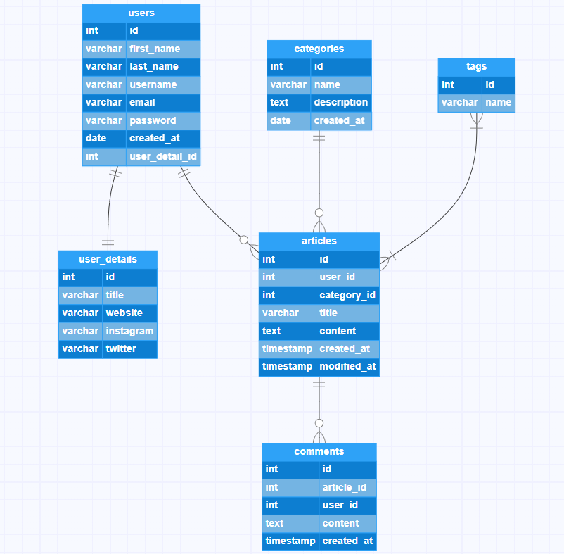

# ✍️ Basic Blog Website Entity-Relationship Diagram (ERD) and SQL commands

- This is a simple database schema for a blog website. The database can have a "users" table where the details of the users are stored. Each user can write one or more articles listed in an "articles" table. Users can also like and comment on other users' articles.

- Every article can be included in a specific category listed in a "categories" table. An article can have multiple tags stored in a "tags" table. Tags are used to associate articles with specific topics or keywords.

- Finally, there can be a "comments" table. In this table, comments indicating what users think about an article are stored.

- This structure organizes the database to keep track of both the articles and the interactions of the users, thus supporting the basic functionality of a blog site.



<details>
<summary>✅ CREATE DATABASE</summary>

```sql
CREATE DATABASE blog_database
    WITH
    OWNER = postgres
    ENCODING = 'UTF8'
    CONNECTION LIMIT = -1
    IS_TEMPLATE = False;
```

</details>

<details>
<summary>✔️ CREATE TABLE users</summary>

```sql
CREATE TABLE users
(
    id serial NOT NULL,
    first_name character varying(100) NOT NULL,
    last_name character varying(100) NOT NULL,
    username character varying(100) NOT NULL,
    email character varying(100) NOT NULL,
    password character varying(100) NOT NULL,
    created_at date NOT NULL DEFAULT CURRENT_DATE,
    user_detail_id integer NOT NULL,
    CONSTRAINT pk_users PRIMARY KEY (id),
    CONSTRAINT uk_users_username UNIQUE (username),
    CONSTRAINT uk_users_email UNIQUE (email),
    CONSTRAINT fk_users_user_details FOREIGN KEY (user_detail_id)
        REFERENCES public.user_details (id) MATCH SIMPLE
        ON UPDATE CASCADE
        ON DELETE CASCADE
        NOT VALID
);
```

</details>

<details>
<summary>✔️ CREATE TABLE user_details</summary>

```sql
CREATE TABLE user_details
(
    id serial NOT NULL,
    title character varying(100),
    website character varying(100),
    instagram character varying(100),
    twitter character varying(100),
    CONSTRAINT pk_user_details PRIMARY KEY (id)
);
```

</details>

<details>
<summary>✔️ CREATE TABLE categories</summary>

```sql
CREATE TABLE categories
(
    id smallserial NOT NULL,
    name character varying(100) NOT NULL,
    description text,
    created_at date DEFAULT CURRENT_DATE,
    CONSTRAINT pk_categories PRIMARY KEY (id),
    CONSTRAINT uk_categories_name UNIQUE (name)
);
```

</details>

<details>
<summary>✔️ CREATE TABLE tags</summary>

```sql
CREATE TABLE tags
(
    id smallserial NOT NULL,
    name character varying(100) NOT NULL,
    CONSTRAINT pk_tags PRIMARY KEY (id),
    CONSTRAINT uk_tags_name UNIQUE (name)
);
```

</details>

<details>
<summary>✔️ CREATE TABLE articles</summary>

```sql
CREATE TABLE articles
(
    id serial NOT NULL,
    user_id integer NOT NULL,
    category_id smallint,
    title character varying(200) NOT NULL,
    content text NOT NULL,
    created_at timestamp(0) without time zone NOT NULL DEFAULT CURRENT_TIMESTAMP,
    modified_at timestamp(0) without time zone NOT NULL,
    CONSTRAINT pk_articles PRIMARY KEY (id),
    CONSTRAINT uk_articles_title UNIQUE (title),
    CONSTRAINT fk_articles_users FOREIGN KEY (user_id)
        REFERENCES public.users (id) MATCH SIMPLE
        ON UPDATE CASCADE
        ON DELETE CASCADE
        NOT VALID,
    CONSTRAINT fk_articles_categories FOREIGN KEY (category_id)
        REFERENCES public.categories (id) MATCH SIMPLE
        ON UPDATE SET NULL
        ON DELETE SET NULL
        NOT VALID
);
```

</details>

<details>
<summary>✔️ CREATE TABLE article_tags</summary>

```sql
CREATE TABLE article_tags
(
    id serial NOT NULL,
    article_id integer NOT NULL,
    tag_id smallint NOT NULL,
    CONSTRAINT pk_article_tags PRIMARY KEY (id),
    CONSTRAINT uk_article_id_tag_id UNIQUE (article_id, tag_id),
    CONSTRAINT fk_article_tags_articles FOREIGN KEY (article_id)
        REFERENCES public.articles (id) MATCH SIMPLE
        ON UPDATE CASCADE
        ON DELETE CASCADE
        NOT VALID,
    CONSTRAINT fk_article_tags_tags FOREIGN KEY (tag_id)
        REFERENCES public.tags (id) MATCH SIMPLE
        ON UPDATE CASCADE
        ON DELETE CASCADE
        NOT VALID
);
```

</details>

<details>
<summary>✔️ CREATE TABLE comments</summary>

```sql
CREATE TABLE comments
(
    id serial NOT NULL,
    article_id integer NOT NULL,
    user_id integer NOT NULL,
    content text NOT NULL,
    created_at timestamp(0) without time zone NOT NULL DEFAULT CURRENT_TIMESTAMP,
    CONSTRAINT pk_comments PRIMARY KEY (id),
    CONSTRAINT fk_comments_articles FOREIGN KEY (article_id)
        REFERENCES public.articles (id) MATCH SIMPLE
        ON UPDATE CASCADE
        ON DELETE CASCADE
        NOT VALID,
    CONSTRAINT fk_comments_users FOREIGN KEY (user_id)
        REFERENCES public.users (id) MATCH SIMPLE
        ON UPDATE CASCADE
        ON DELETE CASCADE
        NOT VALID
);
```

</details>

<details>
<summary>✔️ CREATE TABLE article_likes</summary>

```sql
CREATE TABLE article_likes
(
    id serial NOT NULL,
    article_id integer NOT NULL,
    user_id integer NOT NULL,
    CONSTRAINT pk_article_likes PRIMARY KEY (id),
    CONSTRAINT uk_article_likes_article_id_user_id UNIQUE (article_id, user_id),
    CONSTRAINT fk_article_likes_article_id FOREIGN KEY (article_id)
        REFERENCES public.articles (id) MATCH SIMPLE
        ON UPDATE CASCADE
        ON DELETE CASCADE
        NOT VALID,
    CONSTRAINT fk_article_likes_user_id FOREIGN KEY (user_id)
        REFERENCES public.users (id) MATCH SIMPLE
        ON UPDATE CASCADE
        ON DELETE CASCADE
        NOT VALID
);
```

</details>

<details>
<summary>✔️ CREATE TABLE user_follows</summary>

```sql
CREATE TABLE user_follows
(
    id serial NOT NULL,
    user_id integer NOT NULL,
    followed_id integer NOT NULL,
    created_at timestamp(0) without time zone DEFAULT CURRENT_TIMESTAMP,
    CONSTRAINT pk_user_follows PRIMARY KEY (id),
    CONSTRAINT pk_user_follows_user_id_followed_id UNIQUE (user_id, followed_id),
    CONSTRAINT pk_user_follows_user_id FOREIGN KEY (user_id)
        REFERENCES public.users (id) MATCH SIMPLE
        ON UPDATE CASCADE
        ON DELETE CASCADE
        NOT VALID,
    CONSTRAINT pk_user_follows_followed_id FOREIGN KEY (followed_id)
        REFERENCES public.users (id) MATCH SIMPLE
        ON UPDATE CASCADE
        ON DELETE CASCADE
        NOT VALID
);
```

</details>
